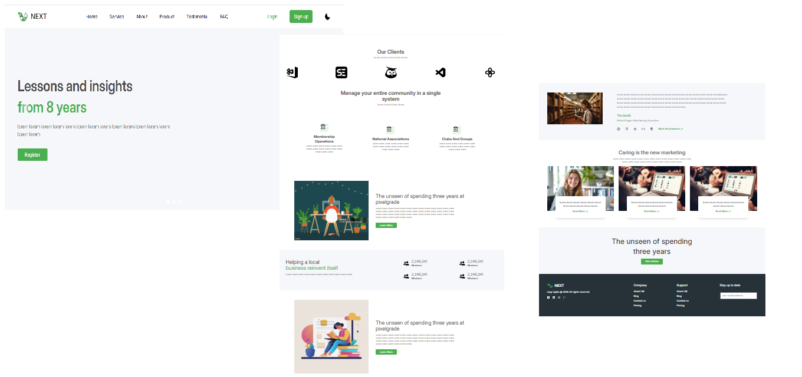

# Next

**Next** is an innovative educational landing page designed to showcase online courses, educational programs, and learning resources. The platform is tailored to attract learners, educators, and institutions seeking a modern and responsive online presence.

## Key Features

- **Modern and Responsive Design**: Built with Tailwind CSS to provide an engaging and user-friendly interface across all devices.
- **Dark Mode Support**: Offers a sleek dark mode for a comfortable viewing experience in low-light environments.
- **Dynamic Components**: Powered by React to deliver fast, interactive, and dynamic elements.
- **Highly Customizable**: The code is clean and well-organized, making it easy to adapt for various educational needs.

---

## Technologies Used

- **React.js**: For building reusable and dynamic UI components.
- **Tailwind CSS**: For crafting visually appealing and responsive layouts.
- **Vite**: To streamline the development process with fast builds and hot module replacement.

---

## Installation and Running

### 1. Clone the Repository:

```bash
git clone
cd
```

### 2. Install Dependencies:

```bash
npm install
```

### 3. Run the Application:

```bash
npm run dev
```

Open your browser and navigate to `http://localhost:5173` to view the landing page in action.

---

## Folder Structure

```plaintext
next/
├── public/         # Static assets
├── src/            # Source files
│   ├── components/ # React components
│   ├── pages/      # Application pages
│   ├── assets/     # Images and other media
│   └── styles/     # Tailwind CSS files
├── .gitignore      # Files ignored by Git
├── package.json    # Project configuration and dependencies
└── README.md       # Project documentation
```

---

## Project Screenshots

### Landing Page Screenshot



---

## Contribution

We welcome contributions to enhance the landing page! Feel free to open an **issue** or submit a **pull request** with your ideas or fixes.

---

**Thank you for exploring Next! 🚀**
